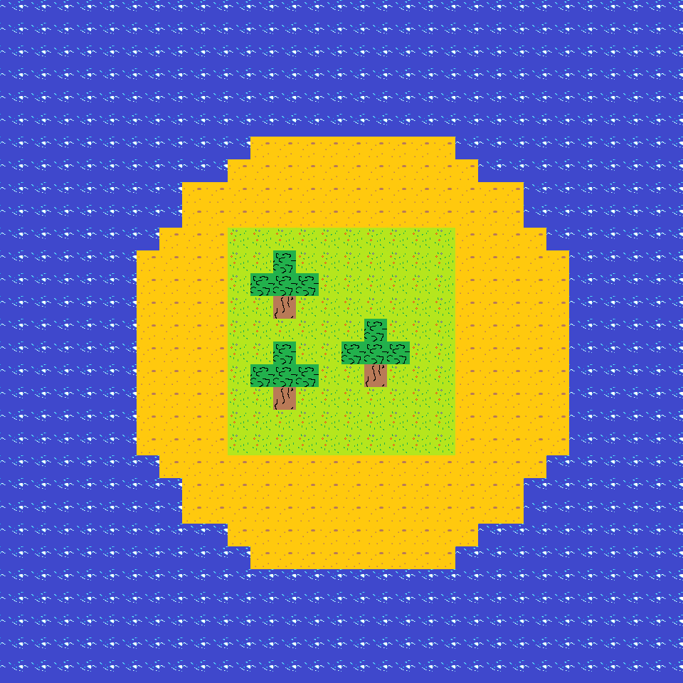
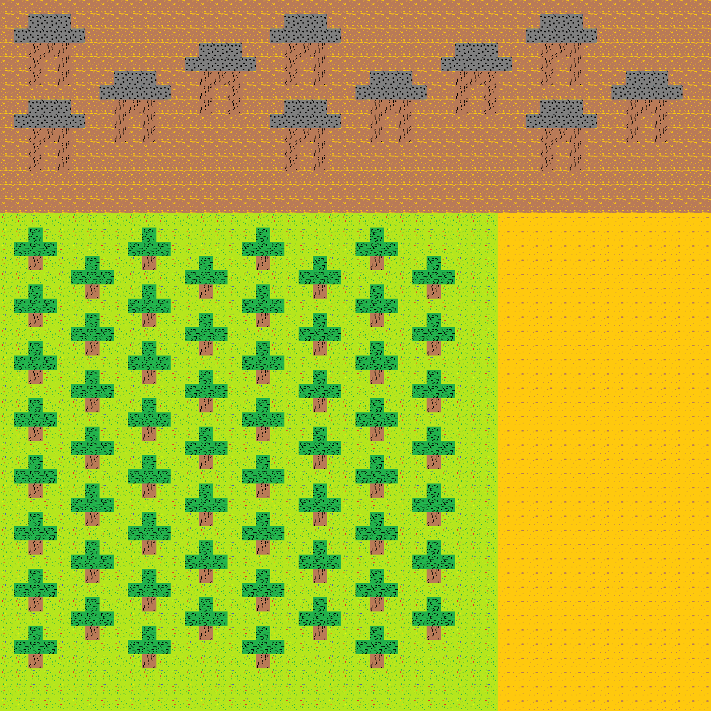

# T6 - Linguagem **TileMap**

Membros:
- Fernando Oliveira
- Martim Lima

## O que é?

É uma linguagem de programação para montar imagens feitas de tiles como um mosaico!

Exemplos de saída:




## Como executar:

1. Fazer o download dos arquivos, tenha java e python instalados!

2. Compilar a linguagem com 

`$ java -jar <arquivo antlr.jar> TileMap.g4 -Dlanguage=Python3 -visitor`
  
3. Caso não esteja instalado, instalar o módulo antlr runtime, e o modulo Pillow para manipulação de imagens
  
 `$ pip install -r requirements.txt`
 
4. Rodar o executavel com:

 `$ python3 main.py <arquivo de entrada> <arquivo de saida>`

 se quiser utilizar um dos programas ja escritos na pasta de testes pode fazer isso rapidamente com

 `$ python3 main.py ./teste/input/teste01.tilemap ./teste/output/teste01`
 `$ python3 main.py ./teste/input/teste02.tilemap ./teste/output/teste02`

 a imagem gerada sera mostrada na tela e será salva em um arquivo .png na pasta `teste/output`

## como programar em **TileMap**

### Mapa

Primeiro deve se declarar um mapa com nome e dimensões, por exemplo:

`mapa meuMapa1 32px 30 x 30`

nesta linha é declarado um mapa chamado `meuMapa1`, cada uma de suas *tiles* quadradas tem 32 pixels de lado e as dimensões do mapa são 30 *tiles* por 30 *tiles*

### Declarações

**ATENÇÃO** - não é obrigatório declarar os elementos do mapa em ordem, mas é recomendavel pois se houver tentativa de utilizar um identificador que ainda não foi declarado o programa irá acusar erro

Para que não ocorram problemas é recomendavel começar declarando as *Tiles*, seguidas pelas *estruturas*, e terminar as declarações com as *regiões*

#### Tiles

Uma *tile* é basicamente uma unidade no mosaico de tiles, como um pixel numa imagem digital normal, é preciso ter arquivos .png para representar as tiles

Se declaram as tiles com a palavra `Tiles:` e cada tile definida individualmente com o seu caminho relativo ao seu programa no sistema de arquivos, por exemplo:

`agua - '..\..\..\assets\agua.png'`

sempre seguindo o formato

`<nome da tile> - '<caminho para tile>'`

#### Estruturas

Para começar a declarar *estruturas* no seu programa utilize a expressão `Estruturs:` seguido por declarar biomas individuais

Uma *estrutura* é uma matriz de tiles que pode ser aplicada em qualquer ponto da imagem, como uma especie de "carimbo" que facilita fazer varios desenhos mais granulares

Para declarar uma estrutura é dado o seu nome seguido de uma matriz textual de tiles previamente declaradas que a representa, por exemplo:

```
arvore:
    [nada, folhas, nada]
    [folhas, folhas, folhas]
    [nada, madeira, nada]
```

os nomes das tiles devem ser separados por vírgula e pode-se usar a palavra `nada` para deixar espaços vazios e só "desenhar" em partes específicas da matriz


#### Biomas

Para começar a declarar *biomas* no seu programa utilize a expressão `Biomas:` seguido por declarar biomas individuais

Um *bioma* representa um conjunto de caracteristicas de uma *região*, no momento é possivel definir:
- qual *tile* serve de plano de fundo no *bioma* (background)
- quais *tiles* podem estar presentes nesse *bioma*
- quais *estruturas* podem estar presentes nesse *bioma*

por exemplo:
`floresta - bg[grama], tiles[grama, terra, folhas, agua], estruturas[arvore, casa]`

seguindo o formato:
`<nome do bioma> - bg[<tile do plano de fundo>], tiles[<nome das tiles presentes no bioma separadas por virgula></tiles>], [<nomes das estruturas presentes no bioma separadas por virgula>]`

No momento apenas é o background é obrigatório e utilizado na declaração de um bioma.

#### Areas
Para começar a declarar *areas* no seu programa utilize a expressão `Areas:` seguido por declarar areas individuais

Areas individuais são sempre declaradas seguindo o formato:
`<nome da area> - <forma geometrica>(<parametros corretos para a forma geométrica>)`


*Areas* são a representações de espaço no mapa e podem ser declaradas nas seguintes formas geométricas:

##### Ponto
Pode ser declarado por si só ou usado como parte de outras formas, para usar em outras formas basta escrever uma tupla de números inteiros entre parenteses:
`(<numero>, <numero>)`

por exemplo:
`(10, 10)`

Para declarar um ponto com um nome dado se usa a seguinte sintaxe:
`<nome> - (<numero>, <numero>)`

por exemplo:
`pt - (10, 10)`

##### Linha

Representa um segmento de reta que começa em um ponto e termina em outro, pode ser declarada com a seguinte sintaxe
`<nome> - (<ponto> - <ponto>)`

por exemplo:
`lin - ((10, 10) - (20, 10))`

##### Retangulo

Representa uma area retangular e pode ser declarado de duas formas:

###### Declaração com dois pontos
Para essa declaração se da dois pontos que representam dois vértices opostos do retangulo:
`<nome> - Retangulo(<ponto>vert, <ponto>vert)`

por exemplo:
`ret1 - Retangulo((10, 10)vert, (20, 20)vert)`

###### Declaração com um ponto e dois lados
Para essa declaração se um ponto que o centro do retangulo e dois números inteiros que representam a largura e altura do retangulo respectivamente:
`<nome> - Retangulo(<ponto>c, <numero>lx, <numero>ly)`

por exemplo:
`ret2 - Retangulo((10, 10)c, 10lx, 5ly)`


##### Círculo
Representa uma area circular e pode ser declarado provendo como parametro um ponto para representar o centro e um número inteiro para representar o raio do circulo:
`<nome> - Circulo(<ponto>c, <numero>r)`

por exemplo:
`circ - Circulo((10, 10)c, 5r)`

#### Regiões
Para começar a declarar *regiões* no seu programa utilize a expressão `Regioes:` seguido por declarar regiões individuais

Uma região representa um conjunto de várias areas com um bioma, para declarar uma região é necessario ter ja declarado pelo menos um bioma e uma área e utilizar a seguinte sintaxe:
`<nome da regiao> - <bioma> areas[ <lista de areas separadas por vírgula> ]`

por exemplo:
`reg - floresta areas[ circ ]`

**ATENÇÃO** no momento apenas uma area de cada vez é suportada ao declarar uma região


#### Comandos
documentação wip,

`Desenhe(<região>)`

`Espalhe(<estrutura>, <região>)`

`Mostrar()`

`Salvar()`